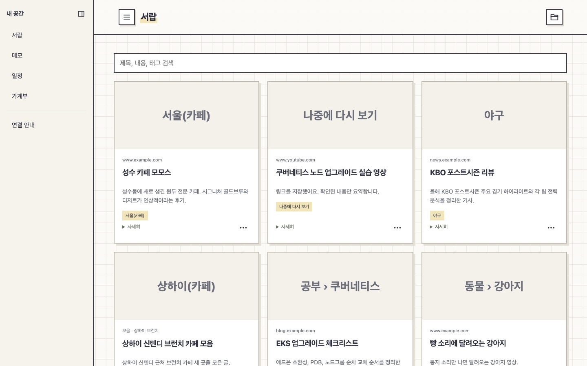
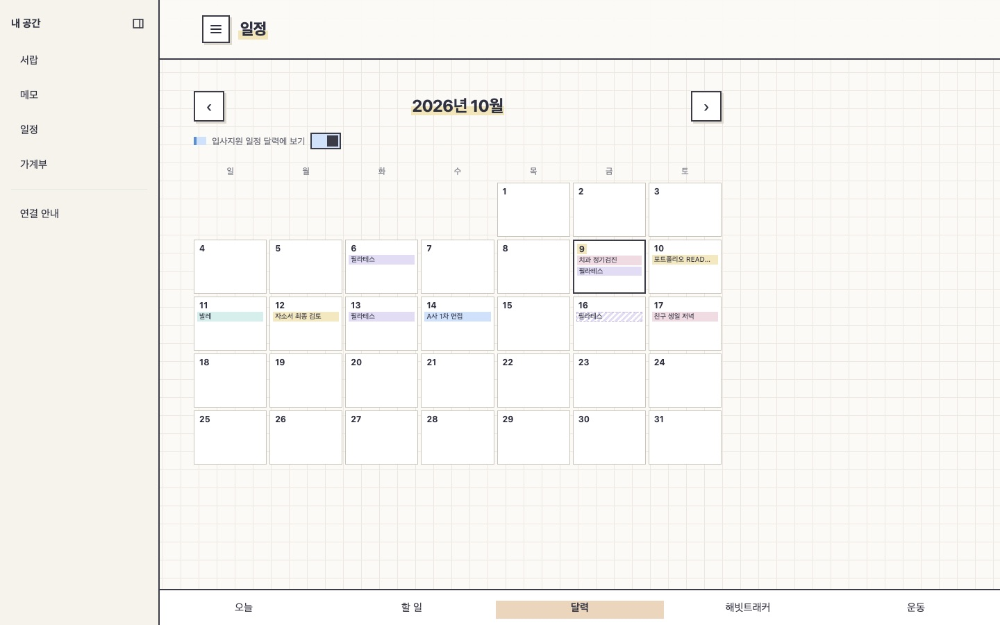
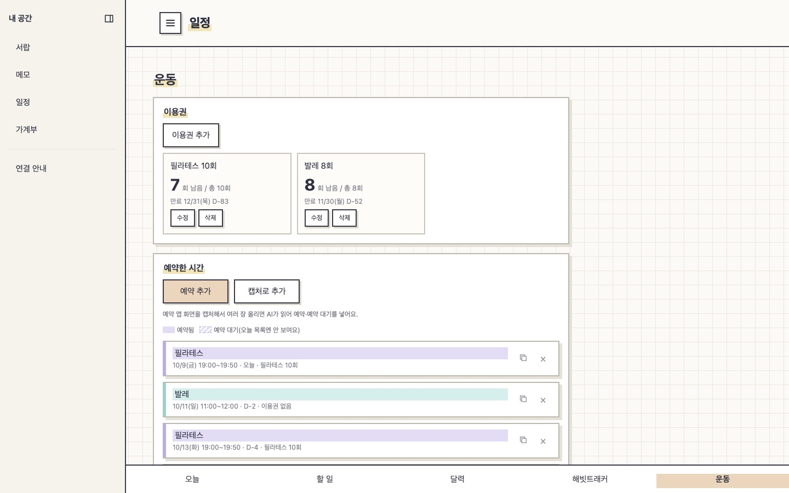
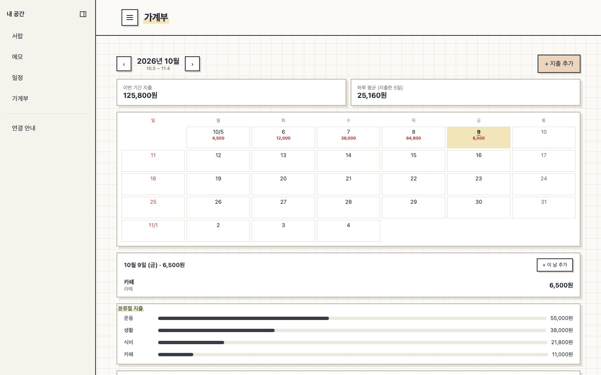
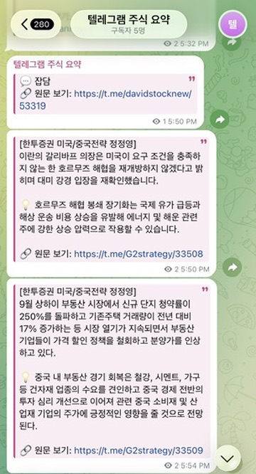
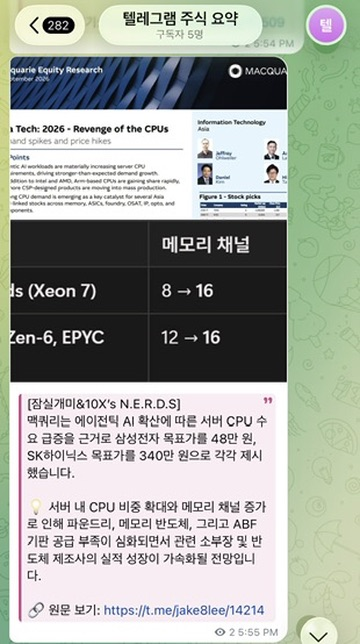

# 황민영 — Platform Engineer 지원

메가존클라우드에서 2023년 5월부터 재직 중이며, 2024년 9월부터 운영 EKS 클러스터를 맡고 있습니다. 클러스터·노드그룹 업그레이드, 장애 대응, Terraform 전환, Argo CD 설정 관리, 모니터링 개선을 실무에서 다뤄왔습니다.

**[경력 포트폴리오 PDF](./황민영_Platform_Engineer_포트폴리오.pdf)**

아래는 업무와는 별개로 평소에 혼자 만들어 쓰는 도구들입니다.

---

## 서랍 (bookmark-shelf)

아이폰에서 링크나 사진을 공유하면 폴더별로 알아서 정리되는 개인용 북마크 도구로 시작했습니다. 저장만 해두고 다시 안 보게 되는 링크가 너무 많아서, 일단 던져두면 나중에 찾기 쉽게 정리는 알아서 되는 걸 만들고 싶었습니다. 지금은 메모·일정·운동 예약·가계부까지 매일 쓰는 것들을 한곳에 모은 개인 앱이 됐습니다.

**기능**
- 공유 시트로 링크·사진을 보내면 AI가 폴더 분류와 요약까지 처리
- 비슷한 링크를 하나로 묶는 "모음", 체크리스트와 버튼을 눌렀을 때만 동작하는 AI 요약이 있는 메모
- 일정: 할 일(마감일)·일정·달력·해빗트래커 탭, 오늘 할 일과 일정을 한 목록으로
- 운동: 이용권별 남은 횟수와 만료일, 예약한 수업 관리. 예약 앱 화면을 캡처해 여러 장 올리면 AI가 읽어 예약·예약 대기로 자동 등록
- 가계부: 매달 5일~다음 달 4일 기간의 달력에 날짜별 지출 합계, 분류별 지출, 체크하면 그날 지출로 기록되는 지출 계획
- 서버 없이 S3 + CloudFront + Lambda로 운영하고, AI 분류·요약은 저장 직후 호출되는 서버리스 워커(Lambda 컨테이너)가 처리

**어떻게 진행했나**
기능은 제가 정하고 Claude Code로 구현한 뒤, 실제로 써보면서 고칠 점을 요청하는 식으로 진행했습니다. 예를 들어 메모를 조금만 고쳐도 AI 요약이 매번 다시 돌아서 미리보기가 계속 바뀌는 게 거슬려서, 버튼을 눌렀을 때만 요약하도록 고쳐 달라고 요청했습니다. 유튜브 링크를 공유하면 분류가 안 되고 "내용 확인 필요" 상태로 계속 남아 있는 것도 발견해서, 유튜브는 아예 AI 분류 없이 바로 "나중에 다시 보기" 폴더에 넣어 달라고 요청해 바꿨습니다. 운영 방식도 계속 조건을 내걸면서 인프라 구성을 개선해 왔습니다 — 맥을 꺼둬도 항상 접속 가능해야 한다, HTTPS로 붙어야 한다, 쓰는 리소스에만 딱 맞는 권한을 줘야 한다는 식으로 요구했고, 그때그때 구성이 바뀌었습니다. 설정하면서 하나씩 붙였던 FullAccess 정책 10개는 실제 쓰는 리소스에만 맞춘 최소 권한 정책 하나로 바꿨고, AI가 스스로 권한을 늘릴 수 있게 IAM 권한까지 열어주는 방식은 쓰지 않고 필요할 때마다 콘솔에서 제가 직접 승인하는 방식으로 정했습니다. 앱이 전체적으로 느리다고 느꼈을 때는 "CloudFront를 쓰는데 왜 캐시는 안 쓰냐"고 물은 것을 계기로, 자주 바뀌는 목록 데이터는 그대로 두고 한 번 올리면 바뀌지 않는 사진만 CloudFront 캐시로 옮겼습니다. 메모를 AI가 요약하는 도중에 고치면 저장도 안 되고 화면을 나가지도 못하는 문제를 신고했을 때는, AI 요약 완료와 사용자 저장이 같은 버전 번호를 올려서 계속 충돌로 거절되던 구조적 원인을 확인하고 두 버전을 분리해 고쳤습니다. 일정·운동·가계부 탭도 같은 방식으로, 직접 써보며 "예약 대기는 같은 색을 옅게", "가계부 기간은 매달 5일부터"처럼 하나씩 요청해 다듬었습니다. 다른 요청·수정 사례는 레포의 [REQUESTS.md](https://github.com/yakc0202/bookmark-shelf-mirror/blob/main/REQUESTS.md)에서 더 볼 수 있습니다(해당 문서는 AI가 작성한 처리 기록이며, 그 자체가 제 기술적 판단을 뜻하지는 않습니다).

**화면**
_(데모용 가짜 데이터로 재현한 화면입니다. 실제 개인 데이터는 공개하지 않습니다.)_

**코드**
https://github.com/yakc0202/bookmark-shelf-mirror
실제 운영 레포는 비공개이고, 공개용으로 스냅샷만 따로 올려뒀습니다.

**한계**
개인 인증키로 로그인하는 혼자 쓰는 앱이라 로그인 데모는 보여드리기 어렵습니다.

---

## 주식 채널 중복 메시지 필터링 봇

관심 있는 주식 정보 채널을 여러 곳 구독해두면 같은 소식이 거의 동시에 여러 번 올라오는 게 불편해서 만든 텔레그램 봇입니다. 겹치는 메시지를 걸러내고 새로운 정보만 한 채널로 모아줍니다.

**기능**
- 해시 비교 → 링크 유사도 → 예외 필터 → 키워드/숫자 유사도 → (애매할 때만) LLM 순서로 중복을 판단해, 대부분의 메시지는 API 호출 없이 처리
- LLM 호출 실패 시 다른 제공자(Anthropic/OpenAI/Gemini)로 전환하는 폴백 처리
- 맥의 self-hosted runner로 배포 자동화

**어떻게 진행했나**
매일 결과 채널에 올라오는 메시지를 확인하면서 오탐·누락을 찾아 수정을 요청하는 식으로 운영해왔습니다. 코드와 README는 Codex로 작성했습니다. 한 번은 중복 판단이 숫자만 비교하다 보니 키움증권 소식과 전혀 무관한 Netflix 소식이 숫자가 겹친다는 이유로 같은 내용 취급돼 하나가 빠진 적이 있었는데, 이를 발견해 수정을 요청했습니다.

포트폴리오를 정리하면서 Claude Code로 그 수정이 실제로 뭘 바꿨는지 코드로 재현해 확인했고, 그 결과를 검토했습니다. 키워드가 전혀 안 겹치는 두 메시지가 우연히 숫자 하나만 같을 때, 수정 전 로직은 유사도 0.3점으로 "애매한 구간"에 들어가 LLM에게 같은 내용인지 다시 확인을 요청했습니다(이 단계에서 LLM이 잘못 답하면 서로 다른 소식 중 하나가 누락될 수 있었습니다). 수정 후에는 같은 입력이 0점으로 나와 처음부터 "다른 정보"로 자동 처리되어 이 경로 자체가 차단됩니다. 이런 식으로 하나씩 막아온 예외 케이스가 지금 11가지 정도 쌓여 있습니다. 당시 LLM이 실제로 무엇을 반환했는지까지는 로그가 없어 확인하지 못했고, 위 재현은 포트폴리오 정리 과정에서 코드만으로 다시 검증한 것입니다. 자동 테스트로 상시 검증되는 부분은 아닙니다.

**화면**
실제로 봇이 중복을 걸러내고 결과 채널로 전달한 메시지입니다.

**코드**
https://github.com/yakc0202/telegram-bot-mirror
운영 레포는 비공개이고, 코드와 문서만 동기화되는 공개 미러입니다.

**한계**
`main.py` 하나에 4천 줄 넘게 몰려 있고 자동 테스트는 없습니다(문법 체크만 CI에 있음). 유저봇 방식이라 계정 제한 위험도 있어 개인용으로만 씁니다.
